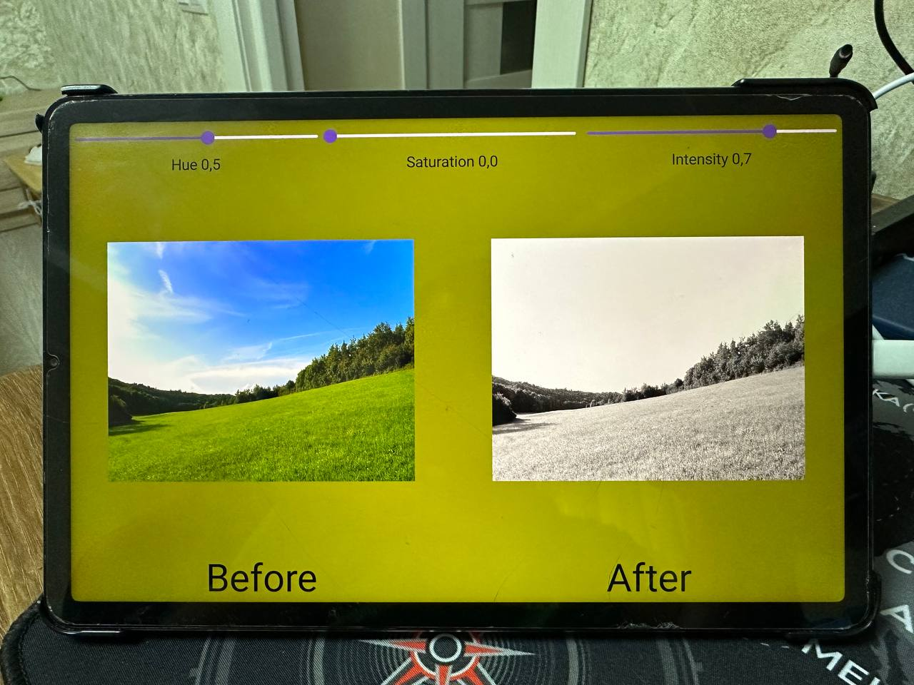

<!DOCTYPE html>
<html>
<body>

<h1>Image processing app powered by Vulkan API as backend and Kotlin with Jetpack Compose framework for UI</h1>
  <b>Platforms:</b> Android
  <b>Technologies:</b> JetPack Compose, Vulkan Api, Kotlin, C++, CMake

This is simple image processing app, applying user input to affect the original image and change HSV color system of the image

</body>
</html>